AE2Things
Neat little additions to AE2-GTNH

This mod adds a new type of cell the DISK: Deep Item Storage disk. This cell has no type limits.

**Infinity cell** 
Can set link mode to link other infinity cell. It will share stored items
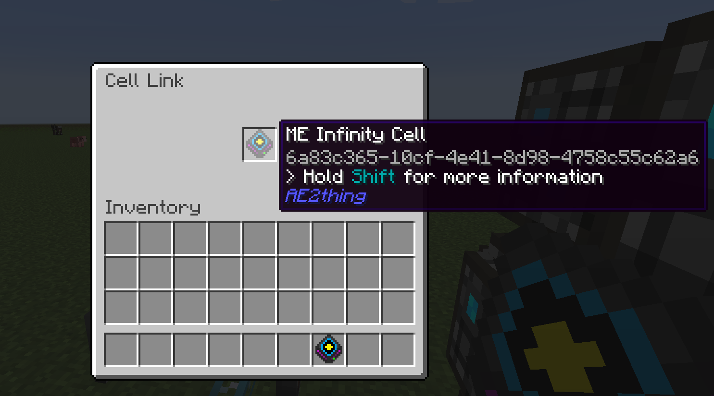
**Toggleable view cell** 
Right click to toggle view cell
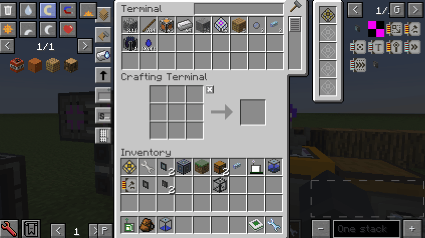
**Pinned Items** 
Backport pinned items
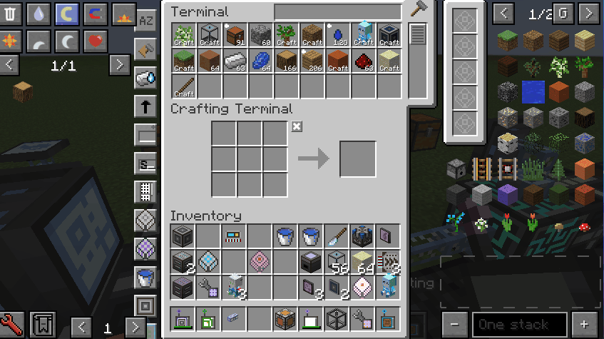
**Crafting complete notification** 
Backport crafting complete notification
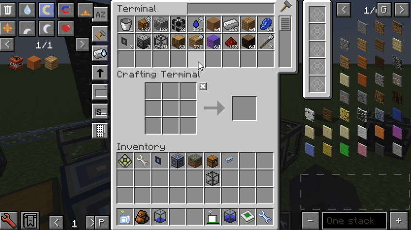
**Terminal menu** 
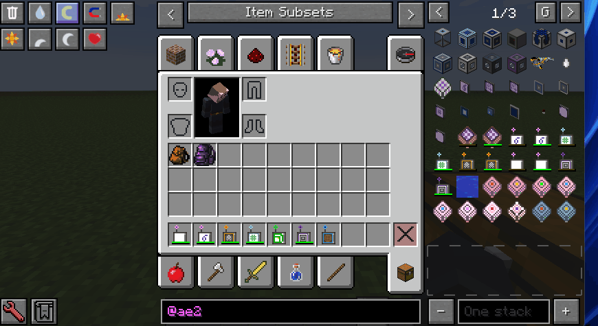
**NEI encode pattern** 
nei support display encode pattern
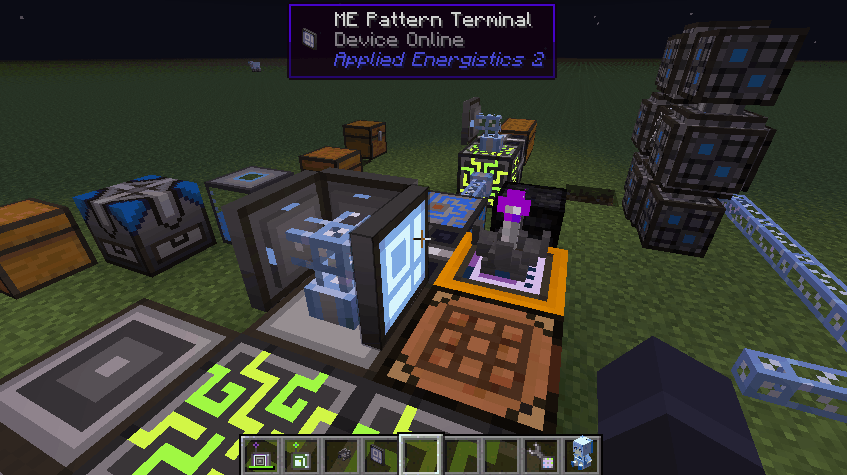
**Cell Content** 
Display cell content
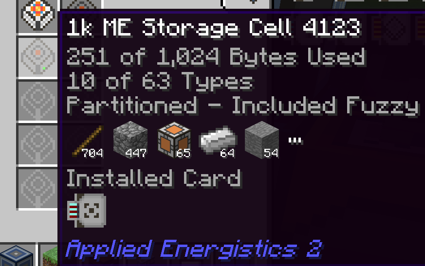
**Middle click to quick take item from me system** 
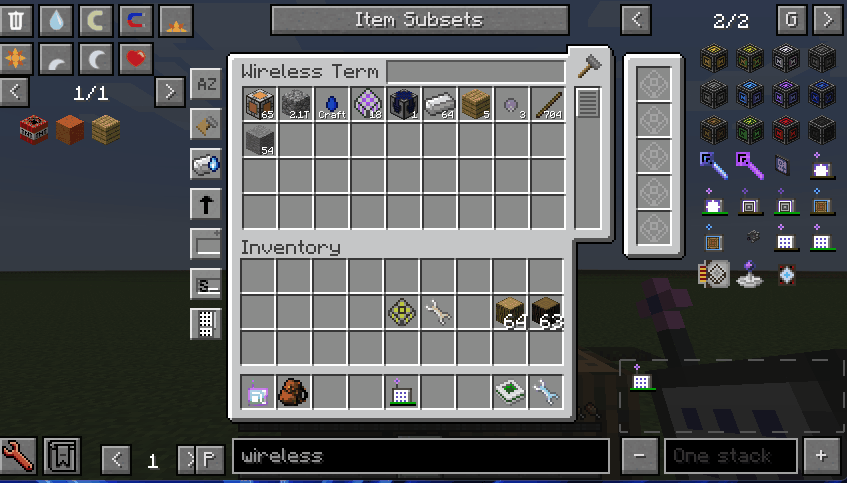
**Backpack Terminal** 
Can easily manage the items in the backpack, support magnet mode and fluid

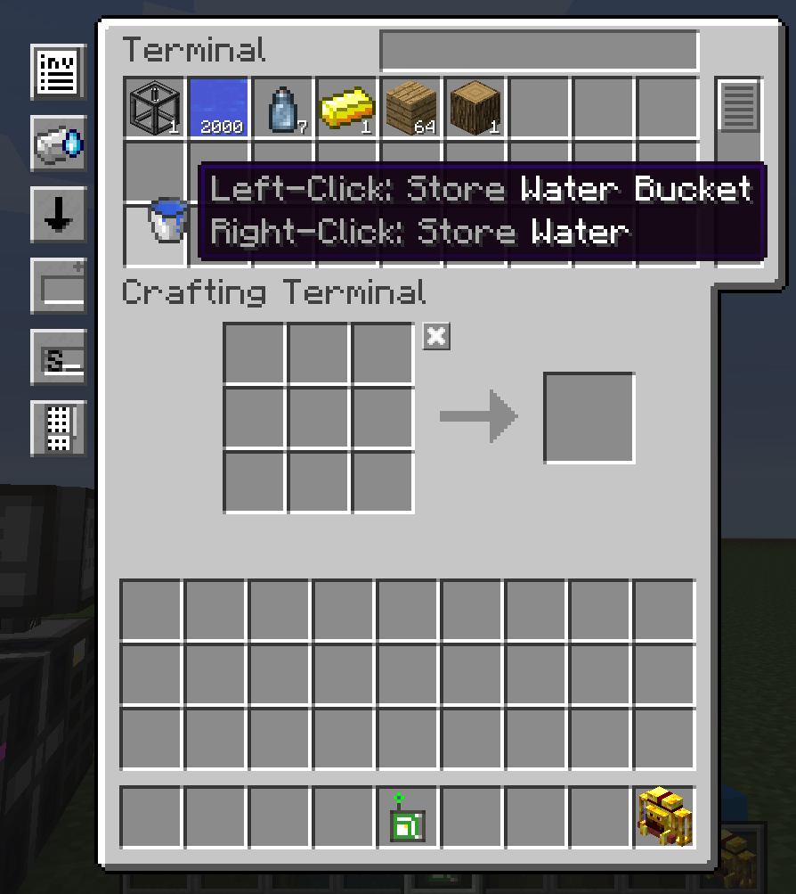
**Dual Interface Terminal** 
Support encode pattern

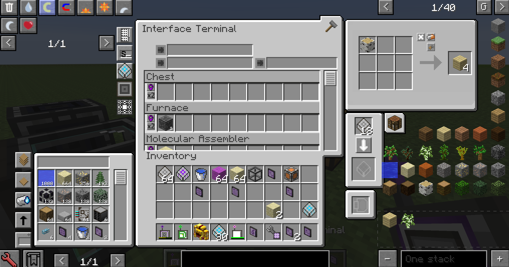
**Rename In Pattern** 
`Ctrl + middle click` to edit item name
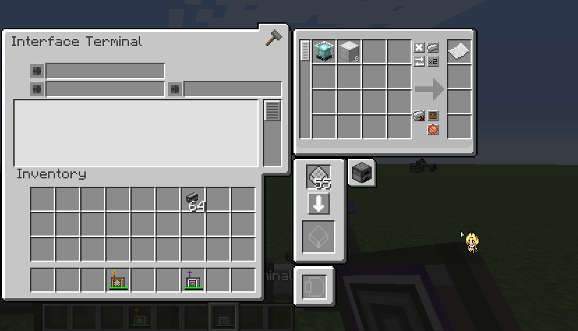
**Infusion Pattern Terminal** 
Support infusion recipe and distillation recipe,Can order fluid and essentia

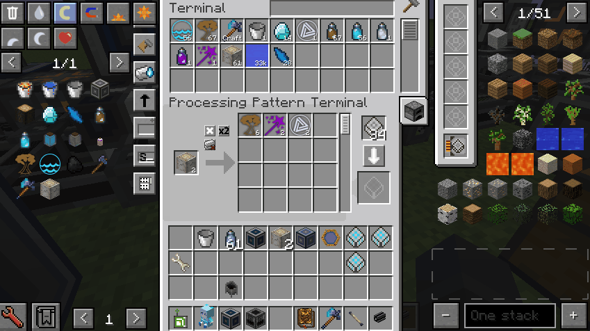
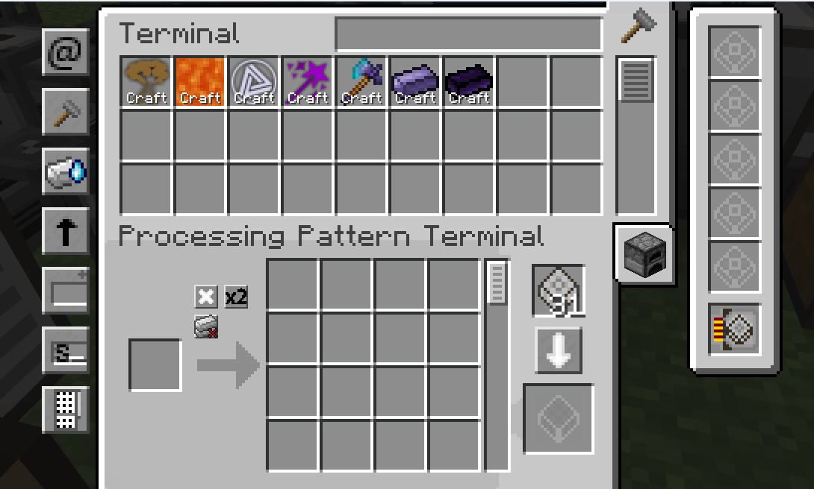
**Essentia discretizer** 
**Thaumatorium Interface** 
**Infusion Interface** 
support infusion intercepter

**Wireless Connector Terminal** 
Can easily manage ae2 stuff wireless connector
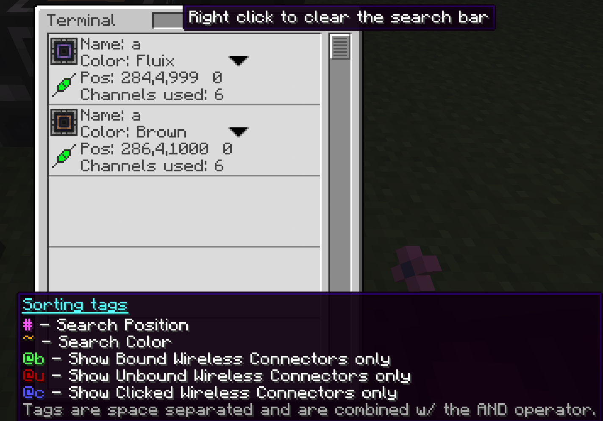 
**ME Fluid Packet Encoder** 
 
**Crafting Debug Card** 
 
FishBig and MDDyue
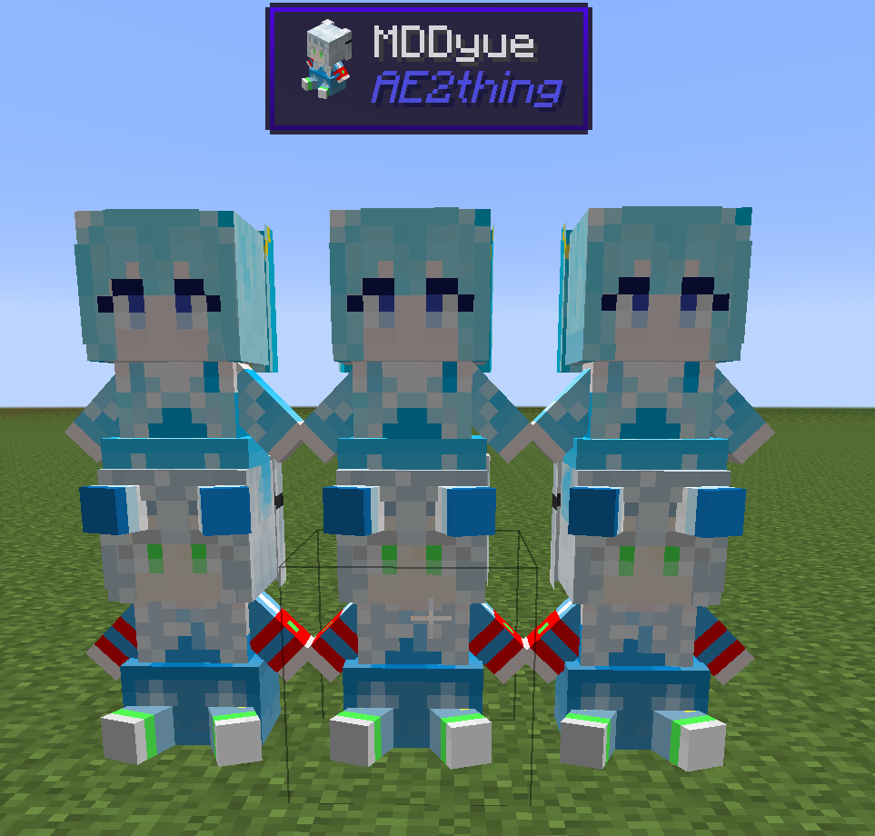

**Request missing items** 
Rework crafting terminal request missing items,support ae2fc universal terminal
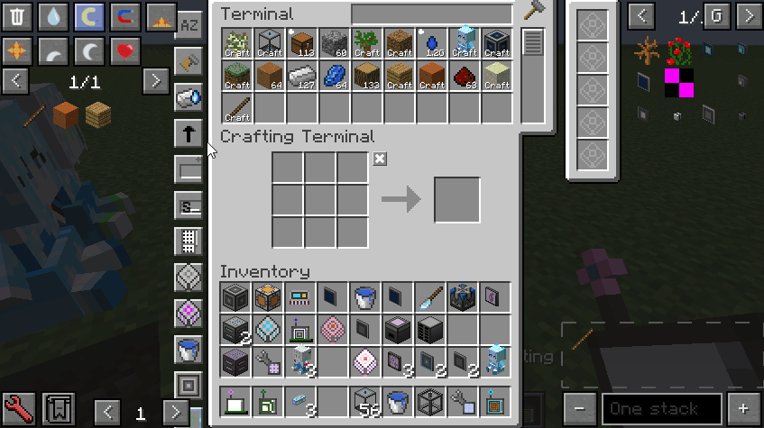
