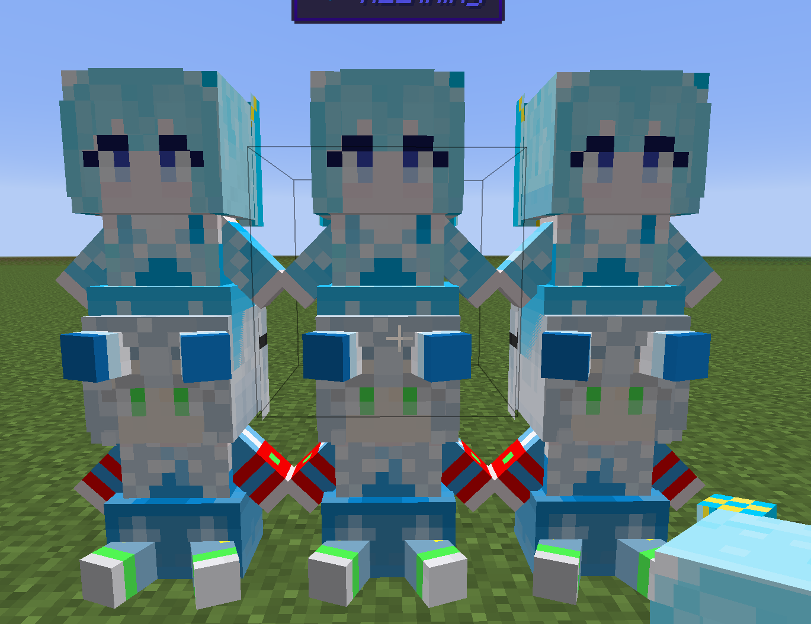

AE2Things
Neat little additions to AE2-GTNH

This mod adds a new type of cell the DISK: Deep Item Storage disk. This cell has no type limits.

**Infinity cell** 
Can set link mode to link other infinity cell. It will share stored items

**Backpack Terminal** 
Can easily manage the items in the backpack, support magnet mode and fluid

**Dual Interface Terminal** 
Support encode pattern

**Infusion Pattern Terminal** 
Support infusion recipe and distillation recipe,Can order fluid and essentia

**Essentia discretizer** 
**Thaumatorium Interface** 
**Infusion Interface** 
support infusion intercepter

**Wireless Connector Terminal** 
Can easily manage ae2 stuff wireless connector
 
**ME Fluid Packet Encoder** 
 
FishBig and MDDyue

