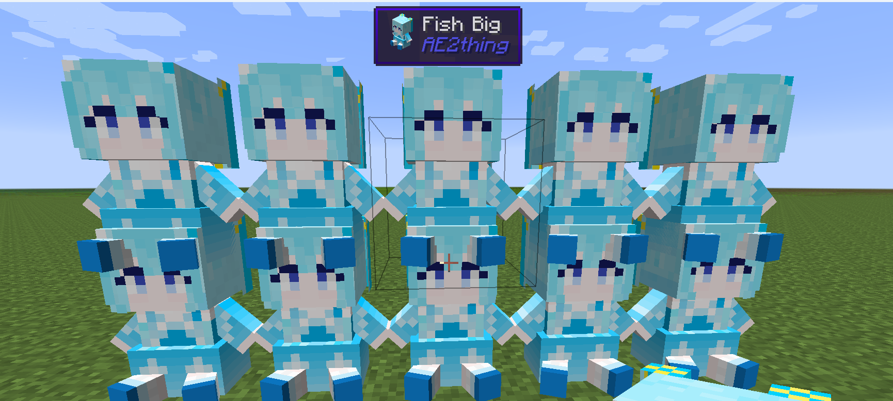

AE2Things
Neat little additions to AE2-GTNH

This mod adds a new type of cell the DISK: Deep Item Storage disk. This cell has no type limits.

**Infinity cell** can set link mode to link other infinity cell. It will share stored items

**Backpack terminal** can easily manage the items in the backpack, support magnet mode and fluid

**Infusion Pattern Terminal** support infusion recipe and distillation recipe,Can order fluid and essentia

**Essentia discretizer**

**Thaumatorium Interface**

**Infusion Interface**

support infusion intercepter

**Wireless Connector Terminal** can easily manage ae2 stuff wireless connector

